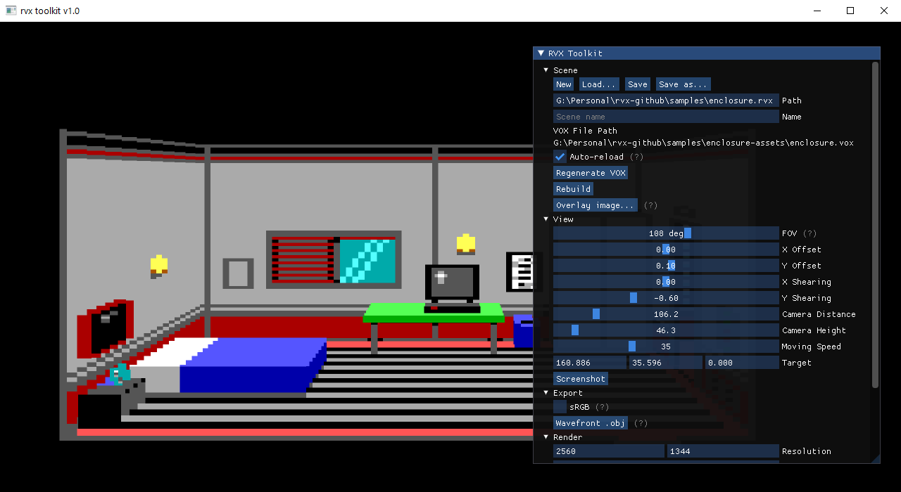
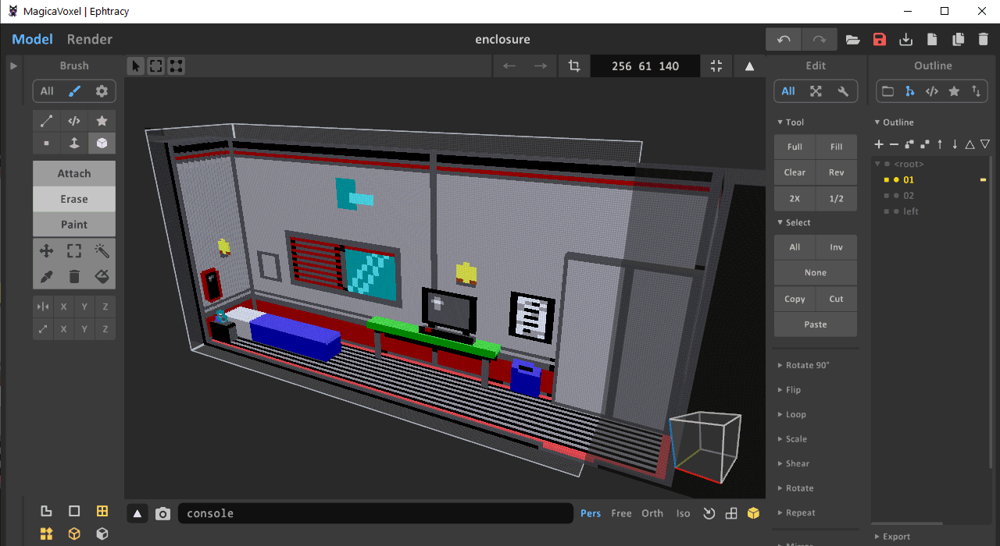
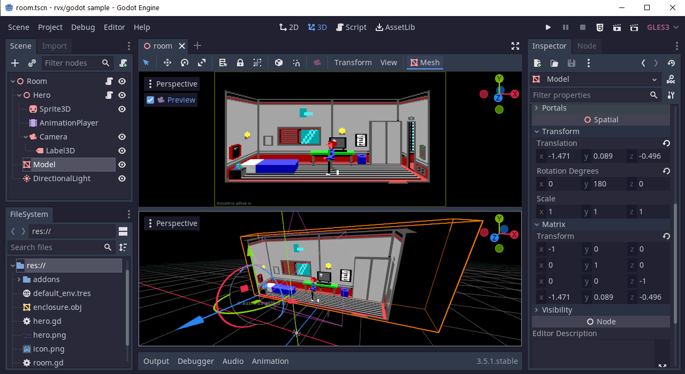
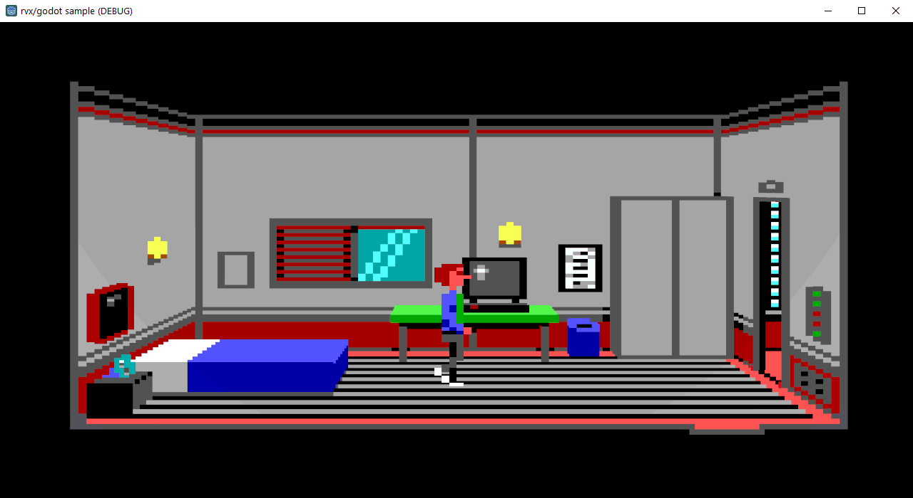

## RVX - Retro VoXel graphics framework

RVX is a graphics framework for replicating low-resolution pixel art scenes in true 3D.

See it in action (YouTube):

## How does it work?

The key concept behind RVX is to model scenes using voxels but render only their front faces.

This retains the pixel-art look and form but there are some drawbacks:
* Due to perspective voxels in front of the scene are larger than in the back

* Hidden voxels will sometimes bleed-through around thin corners

Modelling using voxels is far easier than with free-form shapes, and issues can be addressed with modelling tricks and specialised RVX shaders.

RVX has been initially developed for 160x200 EGA graphics but can be used with higher resolutions and color modes.

## What's included

This repository contains tools to convert, render and export RVX scenes for use with both off-the-shelf and in-house 3D engines.

* __rvx-toolkit__ converts voxel scenes (modelled using [MagicaVoxel](https://ephtracy.github.io "MagicaVoxel")) into RVX style
and allows exporting to 3D engines, with a sample project provided for [Godot Engine](https://godotengine.org/ "Godot Engine")

* __rvx__ folder contains an OpenGL/C rendering library which can be used in custom engines to render RVX scenes, providing more features than 3D exports

* __samples__ folder contains a sample scene from [Enclosure 3-D](https://store.steampowered.com/app/2128440/Enclosure_3D/ "Enclosure 3-D"),
including a [Godot Engine](https://godotengine.org/ "Godot Engine") project which showcases it.
 
RVX is a graphics library, it's not a game logic engine - you can incorporate the style into any type of game or engine.

## Workflows

As an __artist__, you can model RVX scenes and use rvx-toolkit to view the results.

As a __developer__, you can integrate RVX scenes into your game engine.

1. Model the voxel scene using [MagicaVoxel](https://ephtracy.github.io "MagicaVoxel")
2. Use __rvx-toolkit__ for scene setup and live preview
3. Export the scene to a 3D engine (Godot, Unity etc.) or use in your own

## Sample Scene

RVX Toolkit includes a sample scene from [Enclosure 3-D](https://store.steampowered.com/app/2128440/Enclosure_3D/ "Enclosure 3-D") for demonstration.

1. Start __rvx-toolkit__, click Scene->Load and open _enclosure.rvx_ from _samples_ folder.

2. To see/edit the underlying voxel model, download [MagicaVoxel](https://ephtracy.github.io "MagicaVoxel") and open _enclosure.vox_
from _samples\enclosure-assets_ folder.

3. If you have Godot installed, open _project.godot_ from _samples\enclosure\enclosure-assets_. If not, start _rvx-godot-sample.exe_ from
the binary release of RVX Toolkit.

4. If you start the project, you should be able to walk around using arrow keys.

5. To live-modify the scene keep all three applications open:
   * Make changes in MagicaVoxel (if you're new to MV, use Tab to switch world/object mode, then Paint)
   * Click Save in MagicaVoxel
   * Switch to rvx-toolkit, it should automatically refresh and reflect the change
   * Under Export, click "Wavefront .obj"
   * Godot should notice the change and auto-reimport the asset

### How to Model

You can use __rvx-toolkit__ in combination with [MagicaVoxel](https://ephtracy.github.io/) to model RVX scenes.

The toolkit provides a realtime WYSIWYG view
(if you have rvx-toolkit and MagicaVoxel open at the same time, as soon as you save changes in MagicaVoxel, rvx-toolkit will auto-refresh)
but the modelling process is manual.

__To create a new Scene__:

1. _Scene_ -> _New_
2. Under _Blank Construct_ node you will see scene dimensions, default ones are a good start but you can change them and press Enter to reconstruct. You
can always extend the model manually in MagicaVoxel later so these are not binding.
3. When you're happy with the size, _Save as..._ scene in a chosen location.
4. Click _Generate VOX_ to create a .vox (MagicaVoxel) file with the blank template, you will see the path generated.
5. Open the .vox file in MagicaVoxel but keep rvx-toolkit open.
6. Whenever you make and save changes in MagicaVoxel, rvx-toolkit will auto-refresh and reflect these. This is the main modelling loop.
7. You do not need to separately _Save_ the scene in rvx-toolkit if all you do is change the .vox file. _Save_ only stores view/settings.
8. When you're done modelling, proceed to .obj export.

### How to Export

If you'd like to use RVX in your game, you can either:

a) export the scene in Wavefront .obj+.mtl format and import into a 3D game engine (Godot, Unity etc.)

b) if you're writing your own engine, you can use the RVX library to render RVX scenes (written in C using OpenGL)

### Modelling tips

* size your voxel scene to be at least twice the size of the original pixel scene so that you have more wiggle room to compensate for perspective scaling
* always leave spaces between voxels on depth axis as you will need to access inner voxels which normally wouldn't be visible
* side walls usually have to be extended by 4 or more voxels to eliminate gaps when looking at a sharp angle

## Games made with RVX

__Enclosure 3-D__ is a free adventure game developed using RVX engine:

[Get Enclosure 3-D on Steam](https://store.steampowered.com/app/2128440/Enclosure_3D/ "Enclosure 3-D on Steam")

### License

RVX is licensed under [MIT License](LICENSE), you are free to use it in your projects as long as you provide attribution.

Included sample scene from [Enclosure 3-D](https://store.steampowered.com/app/2128440/Enclosure_3D/)
is (c) 2022 Femo Duo Entertainment, All Rights Reserved, included with authors' permission. Do not reuse.

### Acknowledgements

RVX Toolkit incorporates below libraries, see [ThirdParty](ThirdParty.txt) for license information.

* [raylib](https://github.com/raysan5/raylib)
* [open game tools](https://github.com/jpaver/opengametools)
* [Dear ImGui](https://github.com/ocornut/imgui)
* [GLFW](https://github.com/glfw/glfw)
* [glad](https://github.com/Dav1dde/glad)
* [OpenGL Mathematics (glm) for C](https://github.com/recp/cglm)
* [Leksys' INI Parser](https://github.com/Lek-sys/LeksysINI)
* [Native File Dialog](https://github.com/mlabbe/nativefiledialog)

RVX Toolkit is designed to work alongside [MagicaVoxel](https://ephtracy.github.io/) by [ephtracy](https://twitter.com/ephtracy).

Sample [Godot Engine](https://godotengine.org/) project includes [Aseprite Wizard](https://godotengine.org/asset-library/asset/713)
to import the player sprite from [aseprite](https://www.aseprite.org/).

Big thanks to all of the above authors for providing awesome free tools.
